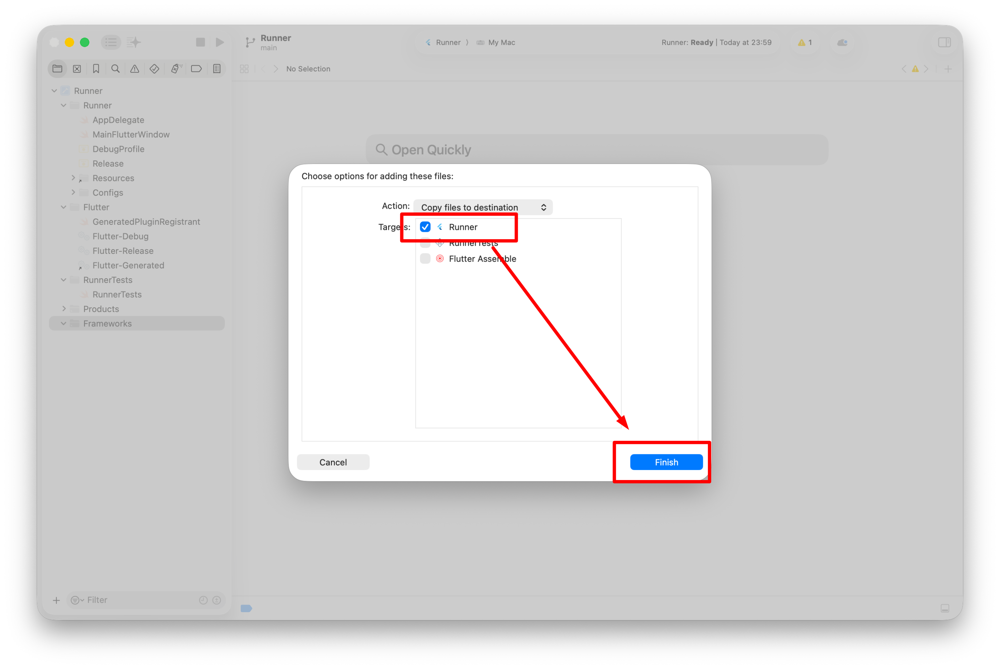
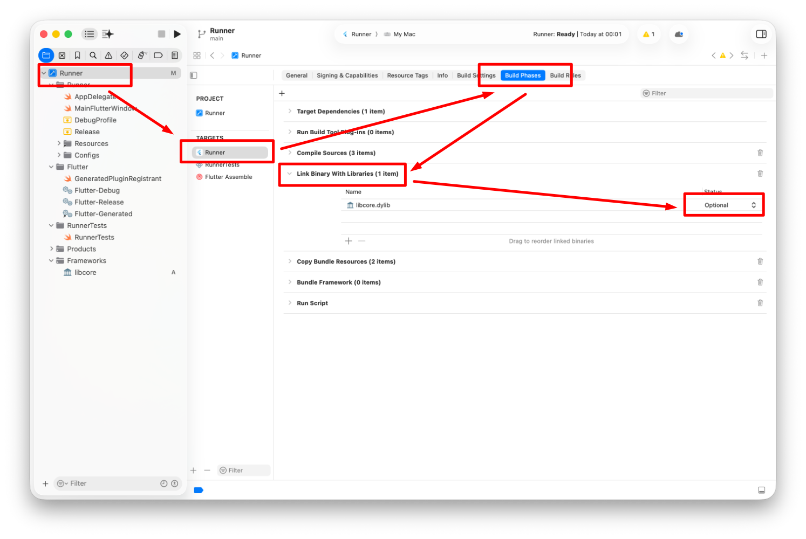
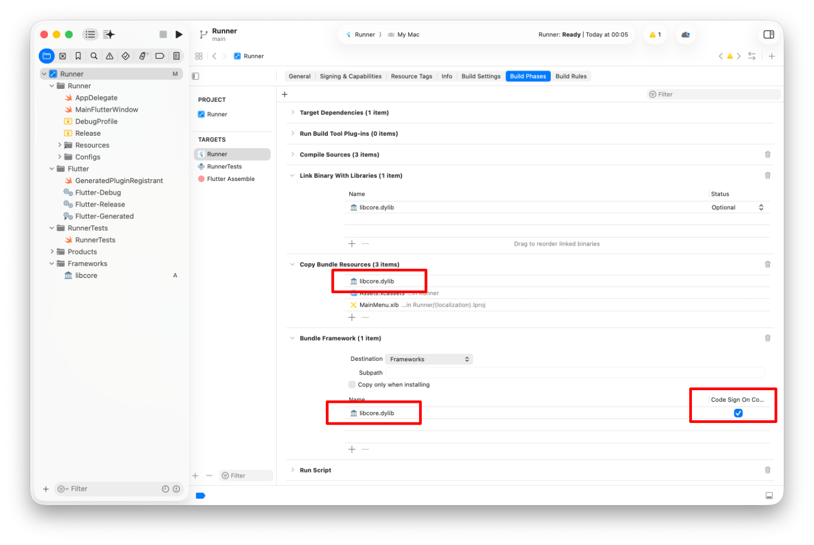
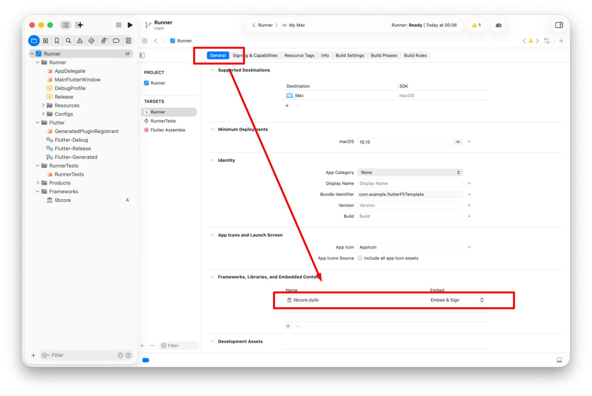
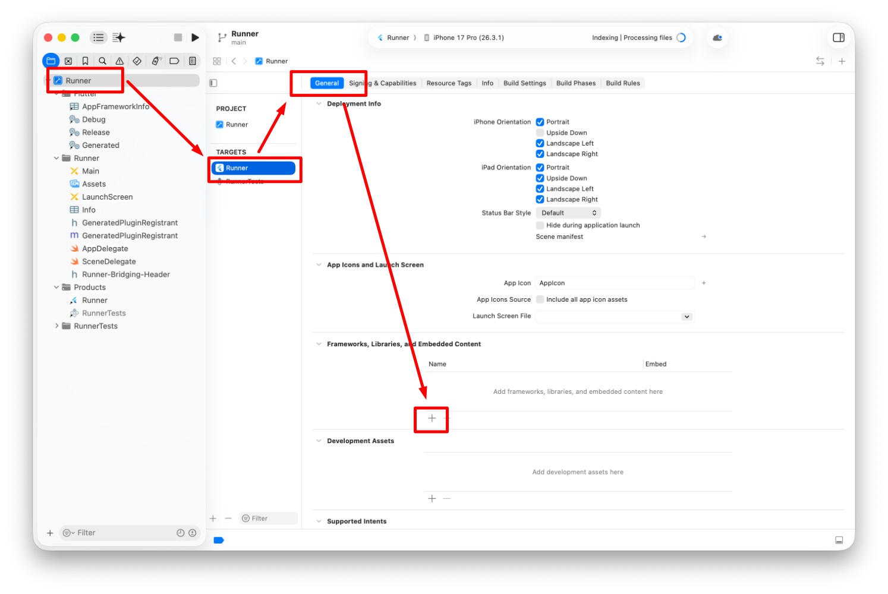
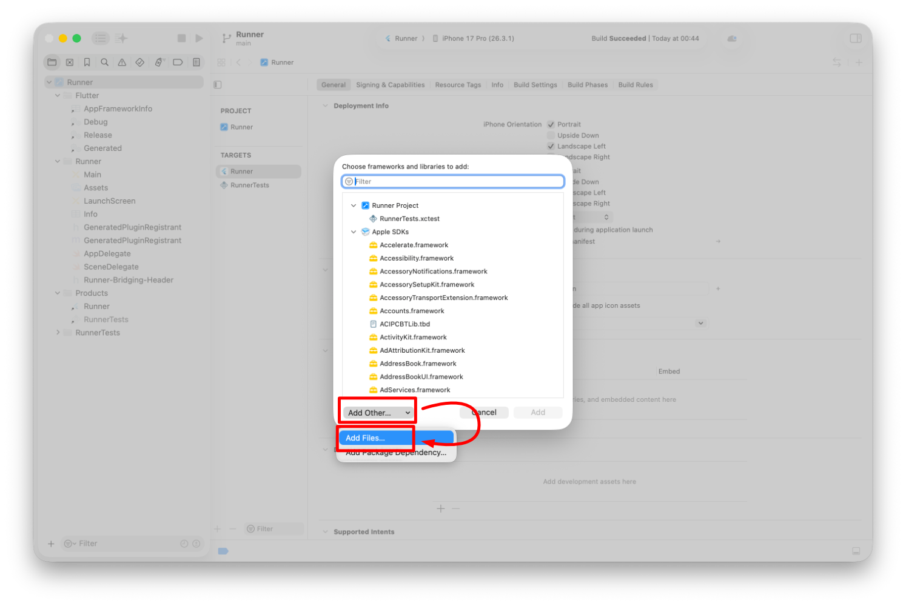
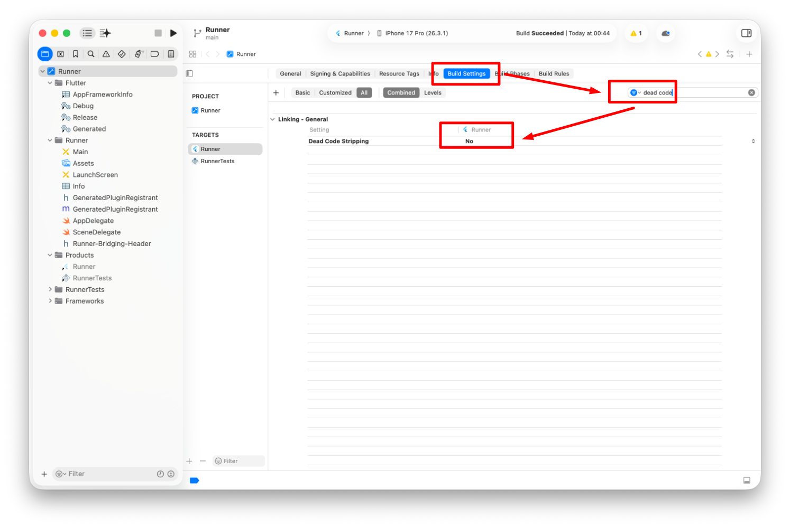
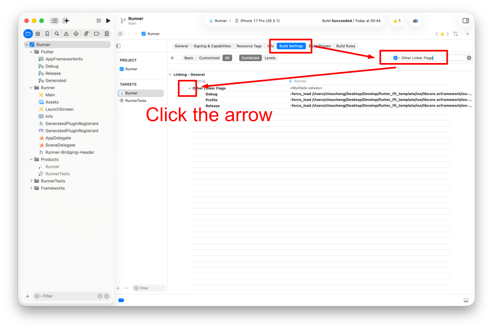
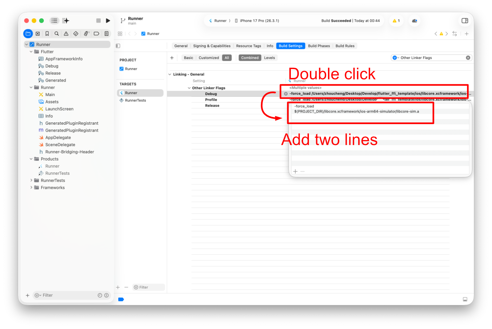

# Flutter FFI Dynamic Library Template

## Steps

### For macOS

1. Generate dylib from `core` or else
2. Open `macos/Runner.xcworkspace` with Xcode
3. Drag dylib file to Frameworks
4. Choose the target `Runner` and click Finish
   
5. Change Status for `Link Binary with Libraries` to Optional (if not included, add it manually)
   
6. Add dylib file to `Copy Bundle Resources` and `Bundle Framework`, and make sure the `Code Sign On Copy` is selected
   
7. Make sure the dylib file is shown on `Frameworks, Libraries, and Embedded Content` and `Embed & Sign` is choosen
   


### For iOS

1. Generate xcframework from `core` or else
2. Open `iOS/Runner.xcworkspace` with Xcode
3. Add `Frameworks, Libraries, and Embedded Content`
   
4. Select `Add Other` - `Add Files` and select xcframework folder
   
5. Search `Dead Code` on `Build Settings` and set `Dead Code Stripping` to `No`
   
6. Search `Other Linker Flags` on `Build Settings`
   
7. Add these these lines for debug and profile/release:
   ```
   -force_load
   $(PROJECT_DIR)/libcore.xcframework/ios-arm64-simulator/libcore-sim.a
   ```
   ```
   -force_load
   $(PROJECT_DIR)/libcore.xcframework/ios-arm64/libcore-device.a
   ```
   